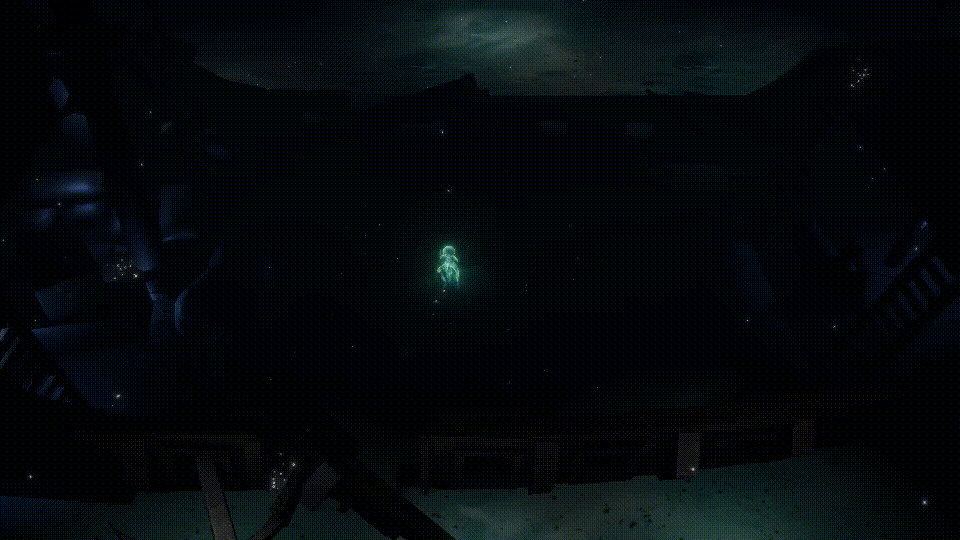

# Dark Waters

The game created on the [Ludum Dare 54](https://ldjam.com/events/ludum-dare/54) Game Jam by:
* Vadstart ([@vadstart](https://ldjam.com/users/vadstart)) (github: [vstovbunsky](https://github.com/vstovbunsky))
  * VFX, Game Design
* Orfodako ([@orfodako](https://ldjam.com/users/orfodako)) (github: [bfilonenko](https://github.com/bfilonenko))
  * Dev
* Maribito ([@maribito](https://ldjam.com/users/maribito))
  * 3D

[Dark Waters](https://ldjam.com/events/ludum-dare/54/dark-waters)

## Description:

In Dark Waters you’ll step into the iridescent tendrils of our fearless protagonist, the Jellyfish Princess, tasked with defending her vibrant undersea Kingdom from the relentless Abyss Octopus, a colossal and malevolent boss monster lurking in the abyssal depths of the ocean.

🐙 Deep Sea Battle: Plunge into the heart of the ocean for an adrenaline-pumping, action-packed boss battle like no other. The Abyss Octopus is hungry for power, and only the Jellyfish Princess stands in its way!

🍣 Mobility is Key: The Jellyfish Princess is not your ordinary hero. Her graceful, fluid movements and incredible agility are your best assets. Evade the Octopus’s relentless attacks, and stay one step ahead to survive. Unleash your slicing skills and transform the Abyss Octopus into delectable sashimi.

🌊 Immerse Yourself: Explore the enchanting, bioluminescent world of the Jellyfish Kingdom, brought to life with stunning visuals and a mesmerizing underwater soundtrack. Every corner of this oceanic realm holds secrets waiting to be discovered.

Used asset: [Unwrapped Ship 3D Model](https://www.turbosquid.com/3d-models/unwrapped-ship-3d-1278443)

Downloads:
* [DarkWaters-Windows.zip](https://files.jam.host/uploads/$376136/DarkWaters-Windows.zip) - 85 Mb
* [DarkWaters-MacM1.zip](https://files.jam.host/uploads/$376136/DarkWaters-MacM1.zip) - 81 Mb
* [DarkWaters-MacIntel.zip](https://files.jam.host/uploads/$376136/DarkWaters-MacIntel.zip) - 83 Mb
